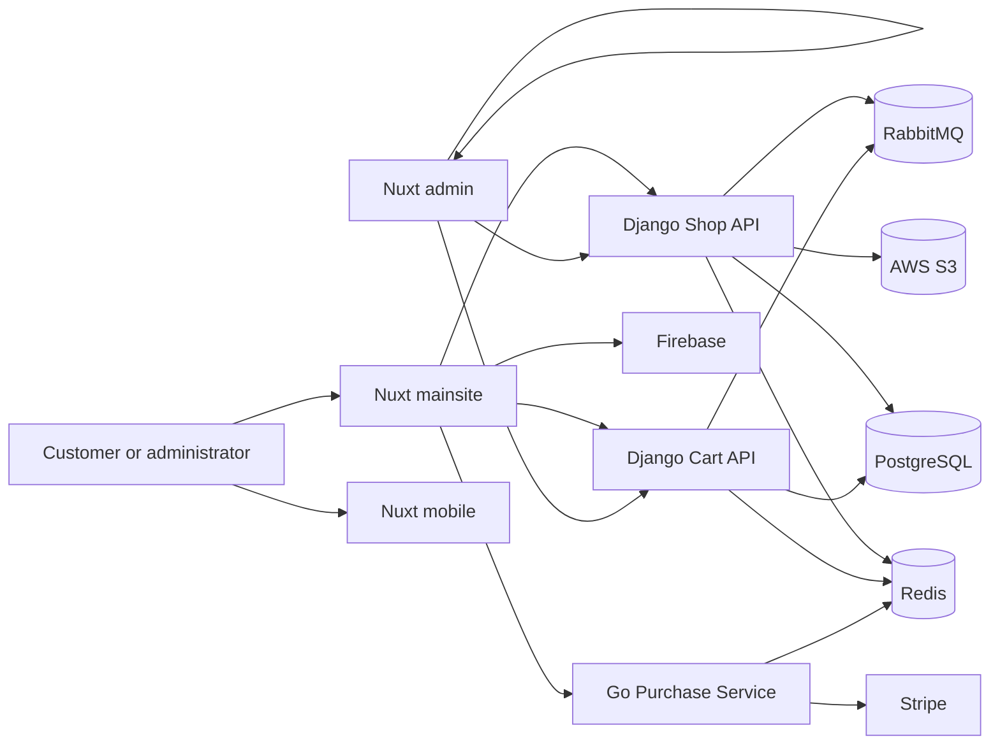

# MyCommerce

MyCommerce is a modular e-commerce platform composed of Nuxt 4 frontends, Django APIs, and a Go payment-orchestration service. The current repository is hosted at [github.com/bayzed123/mycommerce][1]. This README documents the code that is present in this checkout, the connections between its components, the environment variables they consume, the supported development commands, and the known repository limitations that must be addressed before production deployment.

> **Repository status.** The instructions below are based on the current source tree. The active applications are `frontends/admin`, `frontends/mainsite`, `frontends/mobile`, `services/shopapi`, `services/cartapi`, and `services/gopurchase`. Several older instruction and CI files still refer to directories that are not present, such as `services/mystore` and `services/mycart`. Those paths are called out explicitly instead of being presented as working commands.

## Contents

- [What is included](#what-is-included)
- [Architecture and request flow](#architecture-and-request-flow)
- [Repository structure](#repository-structure)
- [Prerequisites](#prerequisites)
- [Clone and install](#clone-and-install)
- [Environment configuration](#environment-configuration)
- [Run the backend services](#run-the-backend-services)
- [Run the Nuxt frontends](#run-the-nuxt-frontends)
- [Service APIs and integration points](#service-apis-and-integration-points)
- [Testing and quality checks](#testing-and-quality-checks)
- [Docker status](#docker-status)
- [CI/CD status](#cicd-status)
- [Postman collection](#postman-collection)
- [MCP integrations](#mcp-integrations)
- [Storage, payments, and external providers](#storage-payments-and-external-providers)
- [Security and production checklist](#security-and-production-checklist)
- [Troubleshooting](#troubleshooting)
- [Known gaps and maintenance notes](#known-gaps-and-maintenance-notes)
- [References](#references)

## What is included

| Component | Location | Technology | Responsibility | Default local address |
| --- | --- | --- | --- | --- |
| Main storefront | `frontends/mainsite` | Nuxt 4, Vue, TypeScript, Pinia | Public catalog, accounts, cart, checkout, localization, SEO, Firebase, Stripe client integration | `http://localhost:3000` |
| Admin dashboard | `frontends/admin` | Nuxt 4, Vue, TypeScript, Pinia | Product, image, order, user, and analytics administration | `http://localhost:3000` |
| Mobile-oriented Nuxt frontend | `frontends/mobile` | Nuxt 4, Vue, TypeScript | Starter mobile-facing interface and shared frontend experimentation | `http://localhost:3000` |
| Shop API | `services/shopapi` | Django 6, Django REST Framework, GraphQL | Catalog, collections, products, variants, stock, accounts, images, JWT, admin, Swagger/ReDoc, MCP | `http://127.0.0.1:8000` |
| Cart API | `services/cartapi` | Django 6, Django REST Framework, GraphQL, Channels | Cart, discounts, orders, shipments, payment-related workflows, JWT, WebSocket/ASGI, MCP | `http://127.0.0.1:8001` when started on port 8001 |
| Purchase service | `services/gopurchase` | Go, Chi, Stripe, Redis, RabbitMQ client libraries | Payment intent creation, update, capture, and background payment monitoring | Port is controlled by `PORT` |
| Shared infrastructure | `docker-compose.yml`, service `.env.example` files | PostgreSQL, Redis, RabbitMQ, S3, Firebase, Stripe | Runtime dependencies and external integrations | Depends on local configuration |

The root `pnpm-workspace.yaml` includes every directory under `frontends/*`. The Python and Go services are independent projects with their own lockfiles or module files.

## Architecture and request flow

The intended checkout flow is:

1. A customer opens the Nuxt storefront.
2. The storefront reads product and collection data from the Shop API through its server-side BFF routes and composables.
3. The Shop API reads catalog data from PostgreSQL and may use Redis for caching and background work.
4. The customer adds products to the cart. Cart operations are sent to the Cart API, which persists cart and order state and can expose real-time updates through Django Channels.
5. The storefront requests payment-intent operations from the Go purchase service through Nuxt server routes.
6. The Go service communicates with Stripe and Redis and can notify configured downstream endpoints from `services/gopurchase/config.yaml`.
7. The frontend shows the checkout result and the backend records the resulting order or payment state.



The storefront uses Nuxt route rules with server rendering for catalog pages, client rendering for account and cart pages, and prerendering for selected informational pages. The authoritative runtime configuration is in `frontends/mainsite/nuxt.config.ts` and its shared layers under `frontends/mainsite/layers/`.

## Repository structure

```text
.
├── .github/
│   ├── instructions/          # Agent and project conventions
│   ├── skills/                # Repository-specific tooling guidance
│   └── workflows/             # Manual or push-based CI workflows
├── docs/
│   └── ARCHITECTURE.md        # Existing architecture notes and diagrams
├── frontends/
│   ├── admin/                 # Nuxt administration dashboard
│   ├── mainsite/              # Main Nuxt storefront and BFF routes
│   └── mobile/                # Nuxt mobile-oriented starter application
├── services/
│   ├── cartapi/               # Django cart, order, discount, shipment API
│   ├── gopurchase/            # Go payment and purchase service
│   └── shopapi/               # Django catalog and shop API
├── Commerce.postman_collection.json
├── docker-compose.yml
├── package.json               # Root workspace scripts
├── pnpm-workspace.yaml
├── pnpm-lock.yaml
├── reset_project.py
├── SECURITY.md
├── TODO.md
└── README.md
```

Within the Django projects, `manage.py` is the command entry point. The Shop API applications include `accounts`, `collection`, `shop`, `stocks`, and `variants`. The Cart API includes `accounts`, `cart`, `discounts`, `orders`, and `shipments`. The Go service is organized into HTTP handlers, server lifecycle code, Redis integration, ticker jobs, and tests.

## Prerequisites

Install the following before starting local development:

| Tool | Required version or capability | Why it is needed |
| --- | --- | --- |
| Git | Current version | Source control and repository checkout |
| Node.js | Node 22 or newer is recommended; CI uses Node 24 for the admin workflow | Nuxt tooling and frontend builds |
| Corepack/pnpm | Use the package manager versions declared by each frontend | Dependency installation and scripts |
| Python | Python 3.14 or newer | Both Django services declare `requires-python = ">=3.14"` |
| uv | Current version | Fast, locked Python environment management |
| Go | Go 1.25-compatible toolchain for the current `go.mod` | Go purchase service |
| PostgreSQL | A running database accessible to both Django services | Catalog, cart, orders, users, and related data |
| Redis | A running Redis instance | Caching, sessions, payment state, and background jobs |
| RabbitMQ | Required for Celery workflows that use it | Message broker for asynchronous Django tasks |
| Docker | Optional | Container builds and infrastructure experiments |

The repository declares modern dependency versions. Do not silently substitute an older Python or Go version because dependency resolution or language features may fail.

## Clone and install

```bash
git clone https://github.com/bayzed123/mycommerce.git
cd mycommerce
```

### Install frontend dependencies

Install each frontend from its own directory so that the correct local lockfile is used:

```bash
cd frontends/mainsite
corepack enable
pnpm install --frozen-lockfile

cd ../admin
pnpm install --frozen-lockfile

cd ../mobile
pnpm install --frozen-lockfile
```

The root workspace can discover all three frontends, but the root package scripts are convenience wrappers only. Running commands inside the target frontend is less ambiguous and ensures that its lockfile and package scripts are selected.

### Install Python service dependencies

Use one environment per service. `uv sync` creates or updates the service-local `.venv` from the committed lockfile:

```bash
cd services/shopapi
cp .env.example .env
uv sync

cd ../cartapi
cp .env.example .env
uv sync
```

If `uv` is not installed, install it using the official instructions in [uv documentation][2]. Do not commit generated `.env` files or secret values.

### Install Go service dependencies

```bash
cd services/gopurchase
go mod download
cp .env.example .env
```

The Go service calls `godotenv.Load(".env")` at startup, so a local `.env` file is required when running it directly.

## Environment configuration

Each active component includes an example file. Copy the relevant example and fill in real development credentials:

| Component | Template | Local file |
| --- | --- | --- |
| Storefront | `frontends/mainsite/.env.example` | `frontends/mainsite/.env` |
| Shop API | `services/shopapi/.env.example` | `services/shopapi/.env` |
| Cart API | `services/cartapi/.env.example` | `services/cartapi/.env` |
| Go purchase service | `services/gopurchase/.env.example` | `services/gopurchase/.env` |

### Storefront variables

The storefront runtime reads these variables in `frontends/mainsite/nuxt.config.ts` and its layers:

| Variable | Purpose | Typical local value |
| --- | --- | --- |
| `NUXT_PUBLIC_SITE_URL` | Canonical site URL | `http://localhost:3000` |
| `NUXT_PUBLIC_SITE_NAME` | Site title and metadata | `MyCommerce Local` |
| `NUXT_PUBLIC_SITE_ENV` | Environment label | `development` |
| `NUXT_PUBLIC_DJANGO_SHOP_API` | Shop API base URL | `http://127.0.0.1:8000` |
| `NUXT_PUBLIC_DJANGO_CART_API` | Cart API base URL | `http://127.0.0.1:8001` |
| `NUXT_PUBLIC_DJANGO_REVIEWS_API` | Optional reviews API URL | Empty until a reviews service exists |
| `NUXT_PUBLIC_QUART_PROD_URL` | Optional Quart/Flask-compatible backend URL | Empty unless used |
| `NUXT_PUBLIC_GOLANG_PAYMENT_ROUTER_URL` | Optional Go payment router URL | `http://127.0.0.1:9000` |
| `NUXT_PUBLIC_GOLANG_PROD_URL` | Go purchase service URL used by payment server routes | `http://127.0.0.1:9000` |
| `NUXT_PUBLIC_FIREBASE_API_KEY` | Firebase client configuration | Firebase project value |
| `NUXT_PUBLIC_FIREBASE_AUTH_DOMAIN` | Firebase authentication domain | Firebase project value |
| `NUXT_PUBLIC_FIREBASE_DB_URL` | Firebase Realtime Database URL | Firebase project value |
| `NUXT_PUBLIC_FIREBASE_DATABASE_URL` | Alternate example name present in the template | Use the name consumed by the active config |
| `NUXT_PUBLIC_FIREBASE_PROJECT_ID` | Firebase project identifier | Firebase project value |
| `NUXT_PUBLIC_FIREBASE_STORAGE_BUCKET` | Firebase Storage bucket | Firebase project value |
| `NUXT_PUBLIC_FIREBASE_MESSAGING_SENDER_ID` | Firebase messaging sender ID | Firebase project value |
| `NUXT_PUBLIC_FIREBASE_MESSAGE_SENDER_ID` | Alternate name consumed by active config | Firebase project value |
| `NUXT_PUBLIC_FIREBASE_APP_ID` | Firebase app identifier | Firebase project value |
| `NUXT_PUBLIC_FIREBASE_MEASUREMENT_ID` | Firebase Analytics measurement ID | Firebase project value |
| `NUXT_PUBLIC_STRIPE_TEST_SECRET_KEY` | Server-side Stripe test secret | Test-mode Stripe secret |
| `NUXT_PUBLIC_STRIPE_PUBLISHABLE_KEY` | Stripe client key | Test-mode publishable key |
| `NUXT_OG_IMAGE_SECRET` | Open Graph image signing or generation secret | Random local secret |
| `NUXT_PUBLIC_REDIS_HOST` | Nuxt Nitro Redis host | `127.0.0.1` |
| `NUXT_PUBLIC_REDIS_USER` | Optional Redis username | Empty for local Redis |
| `NUXT_PUBLIC_REDIS_PASSWORD` | Optional Redis password | Empty for local Redis |
| `NUXT_PUBLIC_WHATS_APP_URL` | Optional WhatsApp contact URL | Project-specific value |

The checked-in example contains both legacy and current Firebase variable spellings. The active configuration consumes `NUXT_PUBLIC_FIREBASE_DB_URL` and `NUXT_PUBLIC_FIREBASE_MESSAGE_SENDER_ID`; set those names for the current code path and keep any compatibility names only if another layer needs them.

### Shop API variables

Copy `services/shopapi/.env.example` and configure Django, PostgreSQL, Redis, RabbitMQ, Stripe, JWT, AWS, and microservice settings. At minimum, set a non-default `SECRET_KEY`, database credentials, `DB_HOST`, Redis settings, and the required JWT values. Set `USE_S3=True` only after the bucket, region, IAM credentials, and storage permissions are configured.

Important variables include `DEBUG`, `SECRET_KEY`, `DB_NAME`, `DB_USER`, `DB_PASSWORD`, `DB_HOST`, `REDIS_HOST`, `REDIS_PASSWORD`, `RABBITMQ_USER`, `RABBITMQ_PASSWORD`, `STRIPE_TEST_SECRET_KEY`, `STRIPE_PRODUCTION_SECRET_KEY`, `PY_UTILITIES_JWT_ISSUER`, `PY_UTILITIES_JWT_SECRET`, `VAT_PERCENTAGE`, `USE_S3`, `AWS_S3_BUCKET_NAME`, `AWS_S3_REGION_NAME`, `AWS_S3_ACCESS_KEY_ID`, `AWS_S3_SECRET_ACCESS_KEY`, `AWS_STORAGE_BUCKET_NAME`, `MICROSERVICES`, `GOLANG_ROUTER`, `N8N_API_URL`, and `N8N_TEST_API_URL`.

### Cart API variables

Copy `services/cartapi/.env.example`. Configure `DEBUG`, `SECRET_KEY`, `REDIS_HOST`, `REDIS_PASSWORD`, `RABBITMQ_USER`, `RABBITMQ_PASSWORD`, `PY_UTILITIES_JWT_ISSUER`, `PY_UTILITIES_JWT_SECRET`, `DB_NAME`, `DB_USER`, `DB_PASSWORD`, `STRIPE_PRODUCTION_API_KEY`, and `STRIPE_TEST_SECRET_KEY`. The cart project also declares AWS, Firebase, Celery, Channels, and Stripe dependencies, so configure the corresponding application settings when enabling those features.

### Go purchase variables

Copy `services/gopurchase/.env.example` and add the runtime variables used by the Go source:

```dotenv
DEBUG=true
SERVICE_NAME=gopurchase
PORT=9000
REDIS_ADDRESS=127.0.0.1:6379
REDIS_PASSWORD=
STRIPE_API_KEY=sk_test_replace_me
```

The Go HTTP server parses `PORT` as an integer and binds to all interfaces. It defaults Redis to `localhost:6379` in code, but setting `REDIS_ADDRESS` explicitly is recommended. The checked-in `config.yaml` contains downstream payment, stock, and shipment endpoint URLs; review those URLs before using the service outside local development.

## Run the backend services

Start PostgreSQL, Redis, and RabbitMQ first. Then prepare each Django database:

```bash
cd services/shopapi
uv run python manage.py migrate
uv run python manage.py collectstatic --noinput

cd ../cartapi
uv run python manage.py migrate
uv run python manage.py collectstatic --noinput
```

Create an administrative user in each Django service if required:

```bash
cd services/shopapi
uv run python manage.py createsuperuser

cd ../cartapi
uv run python manage.py createsuperuser
```

### Start Shop API

```bash
cd services/shopapi
uv run python manage.py runserver 127.0.0.1:8000
```

The Shop API exposes catalog and account routes, GraphQL, JWT, Django admin, schema documentation, and an MCP endpoint. Its principal routes are listed in `services/shopapi/shopapi/urls.py`:

```text
GET/POST  /graphql/
          /api/v1/shop/
          /api/v1/collection/
          /api/v1/stocks/
          /api/v1/accounts/
          /auth/v1/token/
          /auth/v1/token/refresh/
          /auth/v1/token/verify/
          /api/schema/swagger-ui/
          /api/schema/redoc/
          /admin/
          /agents/
```

The service Dockerfile's production image runs `entrypoint.sh`, which applies migrations, runs `collectstatic`, and then starts Gunicorn. For local development with Django's development server instead, use `uv run python manage.py runserver` as shown above, or switch the Dockerfile `ENTRYPOINT` to the commented-out development line.

### Start Cart API

Run the Cart API on a separate port so it does not conflict with the Shop API:

```bash
cd services/cartapi
uv run python manage.py migrate
uv run python manage.py runserver 127.0.0.1:8001
```

The Cart API routes are defined in `services/cartapi/cartapi/urls.py` and include:

```text
          /cart/v1/
          /discounts/v1/
          /orders/v1/
          /accounts/v1/
          /auth/v1/token/
          /auth/v1/token/refresh/
          /auth/v1/token/verify/
          /api/schema/swagger-ui/
          /api/schema/redoc/
          /admin/
          /agents/
```

For WebSocket features, use the ASGI-capable stack documented by the Cart API and ensure Redis is reachable. The project also includes Celery and Huey dependencies for background work.

### Start the Go purchase service

With Redis running and `.env` populated:

```bash
cd services/gopurchase
go run .
```

The service starts its HTTP application and ticker application together. Its documented payment routes are:

| Route | Method | Purpose |
| --- | --- | --- |
| `/create` | `POST` | Create a Stripe payment intent |
| `/update` | `POST` or service-specific handler method | Update an existing intent |
| `/capture` | `POST` | Capture a payment intent |

The exact request models are defined in `services/gopurchase/internal/handlers/` and summarized in `services/gopurchase/README.md`. Use Stripe test credentials and test payment methods during development.

### Background workers

Celery workers are available in both Django projects. Start them from the relevant service directory after configuring RabbitMQ and Redis:

```bash
cd services/shopapi
uv run celery -A shopapi.celery_app worker -E --loglevel=info
uv run celery -A shopapi.celery_app beat --loglevel=info --scheduler django_celery_beat.schedulers:DatabaseScheduler
uv run celery -A shopapi.celery_app flower --loglevel=info
```

```bash
cd services/cartapi
uv run celery -A cartapi.celery_app worker -E --loglevel=info
uv run celery -A cartapi.celery_app beat -E --loglevel=info --scheduler django_celery_beat.schedulers:DatabaseScheduler
uv run celery -A cartapi.celery_app flower --loglevel=info
```

Some task modules use Huey instead of Celery. Where the service defines a Huey consumer entry point, start it using the module path from that service's source, for example:

```bash
uv run huey_consumer cartapi.huey_starter.huey_task -w 4
```

Do not start both task systems for the same job unless the task implementation explicitly requires it.

## Run the Nuxt frontends

### Main storefront

Create `frontends/mainsite/.env`, point its Shop API to port 8000, Cart API to port 8001, and Go service to port 9000, then run:

```bash
cd frontends/mainsite
pnpm dev
```

Build and preview a production bundle:

```bash
pnpm build
pnpm preview
```

The storefront includes unit, Nuxt integration, and Playwright suites:

```bash
pnpm test:unit
pnpm test:nuxt
pnpm test:playwright
pnpm test:coverage
pnpm lint
```

The storefront uses the `base` and `mobile` Nuxt layers. Business logic is organized in composables, and server-side BFF endpoints are under `frontends/mainsite/server/api/`.

### Admin dashboard

The admin frontend has its own package and lockfile. Configure any runtime values required by its composables, then run:

```bash
cd frontends/admin
pnpm dev
pnpm build
pnpm generate
pnpm preview
```

The package currently defines `build`, `dev`, `generate`, `preview`, and `postinstall` scripts. Use the application source and Nuxt configuration for any API URL customization required by the dashboard.

### Mobile-oriented frontend

The current `frontends/mobile` directory is a Nuxt starter-style application rather than a native Flutter project. Run it from its own directory:

```bash
cd frontends/mobile
pnpm dev
pnpm build
pnpm preview
pnpm lint
pnpm typecheck
```

Its current package includes Vitest browser testing through `pnpm test:browser` and a watch-oriented test command. The mobile frontend has its own `pnpm-workspace.yaml`, so do not assume that root-level installation behavior is identical to the other frontends.

## Service APIs and integration points

### Shop API

The Shop API is the catalog authority. It provides REST routes under `/api/v1/`, a GraphQL endpoint at `/graphql/`, JWT authentication, schema endpoints, Django admin, and an MCP route. Product images can use local storage in development or S3-compatible storage when `USE_S3=True` and the AWS variables are correctly configured.

### Cart API

The Cart API owns cart and order-related operations. Its code includes discounts, orders, shipments, accounts, JWT, REST, GraphQL-related dependencies, background tasks, and Channels support. The frontend's cart composables use the Cart API base URL from `NUXT_PUBLIC_DJANGO_CART_API`.

### Go purchase service

The Go service is deliberately separated from the Django catalog and cart APIs. It owns payment-intent orchestration and recurring ticker work. Redis stores service state and Stripe is the payment provider. `config.yaml` describes optional payment, stock, and shipment downstream endpoints. Its Go module path is `github.com/bayzed123/mycommerce/services/gopurchase`, matching this repository.

### Firebase and analytics

The storefront's Nuxt configuration includes Firebase/VueFire, Google Analytics, Google Tag Manager, Stripe, and optional Redis-backed Nitro storage. Supply credentials through environment variables and never hardcode private keys into Vue components or committed configuration.

## Testing and quality checks

Run checks from each project directory rather than assuming that a root command covers every application.

### Main storefront

```bash
cd frontends/mainsite
pnpm lint
pnpm test:unit
pnpm test:nuxt
pnpm test:playwright
pnpm build
```

### Admin frontend

The current admin package does not declare a `test` or `lint` script even though the checked-in workflow invokes those commands. Use the commands present in `frontends/admin/package.json` first:

```bash
cd frontends/admin
pnpm exec nuxt prepare
pnpm build
```

Treat the admin CI workflow as needing repair before relying on it as a green quality gate.

### Mobile frontend

```bash
cd frontends/mobile
pnpm lint
pnpm typecheck
pnpm test:browser
pnpm build
```

### Django services

```bash
cd services/shopapi
uv run pytest
uv run python manage.py check

cd ../cartapi
uv run pytest
uv run python manage.py check
```

The service `pyproject.toml` files define pytest markers such as `unit`, `api`, `integration`, and `slow`. Use marker selection when narrowing a test run:

```bash
uv run pytest -m unit
uv run pytest -m 'not slow'
```

### Go service

```bash
cd services/gopurchase
go test ./...
go vet ./...
go build ./...
```

## Docker status

The repository contains service-local Dockerfiles for the two Django APIs, the Go purchase service, and the main storefront. They can be built independently:

```bash
docker build -t mycommerce-shopapi services/shopapi
docker build -t mycommerce-cartapi services/cartapi
docker build -t mycommerce-gopurchase services/gopurchase
docker build -t mycommerce-mainsite frontends/mainsite
```

The root `docker-compose.yml` has been rewritten to match this checkout: PostgreSQL, Redis, RabbitMQ, `shopapi`, `cartapi`, `gopurchase`, and their Celery workers. It no longer references the legacy `mystore`/`mycart`/`myreviews`/`subscribers`/`goauthentication` directories. To use it:

```bash
cp services/shopapi/.env.example services/shopapi/.env
cp services/cartapi/.env.example services/cartapi/.env
cp services/gopurchase/.env.example services/gopurchase/.env
# fill in real SECRET_KEY, JWT secrets, and Stripe keys in each .env
docker compose up --build
```

`docker/postgres/init-multiple-databases.sh` creates the separate `mystore` and `mycart` databases used by the Shop and Cart APIs inside the single `postgres` container. Do not place production secrets in the Compose file itself; use the `.env` files (already `.gitignore`d) or your deployment platform's secret store. Nuxt frontends are not part of this Compose file — run them with `pnpm dev`, or deploy them to Cloudflare Pages/Workers, against the API base URLs these containers expose.

## CI/CD status

The repository includes:

- `.github/workflows/shopapi.yml` — installs with `uv`, runs `manage.py check` and `pytest` for `services/shopapi` against ephemeral Postgres and Redis service containers, then builds its Docker image.
- `.github/workflows/cartapi.yml` — the same test/build pipeline for `services/cartapi`.
- `.github/workflows/gopurchase.yml` — `go vet`, `go test`, and `go build` for `services/gopurchase` against ephemeral Redis and RabbitMQ containers, then builds its Docker image. `tests/integration` is excluded because it calls the live Stripe API and expects a committed `.env` file.
- `.github/workflows/mainsite.yml` — lint, unit tests, and a production build for `frontends/mainsite`.
- `.github/workflows/frontends.yml` — the existing admin-oriented frontend workflow (manual dispatch only).
- `.github/workflows/worker.yml` — deploys the Cloudflare Worker gateway (manual dispatch, needs `CLOUDFLARE_API_TOKEN`/`CLOUDFLARE_ACCOUNT_ID` repository secrets).
- `.github/workflows/pypi.yml` — tests, builds, and (on a `mycommerce-platform-v*` tag or manual dispatch) publishes `packages/mycommerce-platform` to PyPI via Trusted Publishing.
- `frontends/mobile/.github/workflows/ci.yml` — installs dependencies, lints, and type-checks the mobile frontend on push.

All of the service and frontend workflows above trigger on `push`/`pull_request` to `main` (scoped to their own path) as well as `workflow_dispatch`, so pushing to `main` now runs the matching pipeline automatically instead of requiring a manual run.

## Postman collection

`Commerce.postman_collection.json` contains request examples for manually exercising commerce APIs. Import it into Postman, set environment variables for the active Shop API and Cart API base URLs, and use test credentials rather than any credentials that may be present in old fixtures. Confirm every request path against the current Django URL files before using the collection for automated testing.

## MCP integrations

Both Django services include MCP server dependencies and expose an `agents/` route. The service READMEs document the MCP Inspector pattern:

```bash
npx @modelcontextprotocol/inspector uv --directory /absolute/path/to/mycommerce/services/shopapi run python manage.py stdio_server
```

```bash
npx @modelcontextprotocol/inspector uv --directory /absolute/path/to/mycommerce/services/cartapi run python manage.py stdio_server
```

Run MCP access only against trusted local environments. MCP tools can expose application data or administrative operations depending on the configured server and user permissions.

## Storage, payments, and external providers

The complete deployment may use the following external systems:

| Provider | Used for | Configuration area |
| --- | --- | --- |
| PostgreSQL | Relational commerce data | Django `DB_*` variables |
| Redis | Cache, session, payment state, Channels, and task support | `REDIS_*` and Go `REDIS_ADDRESS` |
| RabbitMQ | Celery broker and asynchronous work | `RABBITMQ_*` variables |
| Stripe | Payment intents and capture | Stripe variables in the storefront, Django, and Go service |
| Firebase | Client authentication, storage, and analytics-related features | `NUXT_PUBLIC_FIREBASE_*` |
| AWS S3 | Product and media storage | `AWS_*`, `AWS_STORAGE_BUCKET_NAME`, and `USE_S3` |
| n8n | Optional automation integration | `N8N_API_URL` and `N8N_TEST_API_URL` |
| CloudFront or another CDN | Optional delivery of static/media assets | Deployment configuration outside the active app code |

Use test-mode Stripe keys locally. Restrict AWS IAM permissions to the required buckets and operations. Configure CORS and allowed hosts for the actual frontend domains instead of using permissive development settings in production.

## Security and production checklist

Before deployment:

1. Replace every example secret with a generated secret stored in a secret manager or protected deployment environment.
2. Set `DEBUG=False` and configure Django allowed hosts, CORS, CSRF, secure cookies, and HTTPS settings.
3. Use separate PostgreSQL databases and Redis credentials for development, staging, and production.
4. Configure Stripe webhooks and verify webhook signatures before changing order state.
5. Restrict AWS bucket access and use a CDN only after the storage policy has been reviewed.
6. Run migrations and `collectstatic` as explicit deployment steps.
7. Run Django checks, Python tests, Go tests, frontend tests, and production builds before release.
8. Remove or rotate any credential-like values found in old fixtures or Postman examples.
9. Protect Django admin, schema documentation, MCP endpoints, Flower, and Redis from public exposure.
10. Replace the stale root Compose and CI paths before using them for an automated deployment.

## Troubleshooting

### The frontend starts but shows API errors

Confirm that the Shop API is running on the URL in `NUXT_PUBLIC_DJANGO_SHOP_API`, the Cart API is running on the URL in `NUXT_PUBLIC_DJANGO_CART_API`, and the Go service is running on the URL in `NUXT_PUBLIC_GOLANG_PROD_URL`. Restart Nuxt after changing `.env` values.

### Django cannot connect to PostgreSQL

Check `DB_HOST`, `DB_NAME`, `DB_USER`, and `DB_PASSWORD`, verify that PostgreSQL is listening, and run `uv run python manage.py check` from the service directory. A blank `DB_HOST` may be interpreted differently by application settings, so use an explicit local host when required.

### Celery tasks do not run

Verify Redis and RabbitMQ are reachable, confirm broker credentials, and start a worker from the same service directory as the Django project. Inspect the task module and application name before selecting the `-A` argument.

### The Go service exits immediately

The current `main.go` requires `.env`. Check that `PORT` is a numeric value and that `SERVICE_NAME` is set. Then verify `REDIS_ADDRESS` and `STRIPE_API_KEY`. A missing `.env` causes startup to panic before the server begins listening.

### `pnpm install --frozen-lockfile` fails

Run it inside the specific frontend directory. Confirm that Corepack is enabled and that the installed pnpm major version matches that frontend's `packageManager` field. Do not delete a lockfile to bypass a reproducibility error.

## Known gaps and maintenance notes

The repository contains useful but partially outdated planning material. `docs/ARCHITECTURE.md`, `.github/instructions/project-instructions.md`, and several service READMEs still refer to an earlier service layout (`mystore`, `mycart`, `myreviews`, `subscribers`, `goauthentication`, `services/shop`). The active source tree is the authority for paths and commands; `docker-compose.yml` and the `.github/workflows/*.yml` CI pipelines have been updated to match it (see [Docker status](#docker-status) and [CI/CD status](#cicd-status)).

The current root package scripts include frontend convenience commands, but they do not provide a complete all-services orchestration command; `docker compose up` is now the closest thing to one for the backend services.

Known application-level bugs, tracked in `TODO.md`, that still need investigation against a live backend: the cart drawer does not show newly added items without a page refresh, the last product added to the cart renders nothing, and `/shop/<id>` product detail pages can 500/crash for some products. These could not be reproduced or fixed in this pass because no Shop/Cart API is deployed anywhere reachable yet — see [Cloudflare Worker and PyPI package](#cloudflare-worker-and-pypi-package).

The frontend environment template and active Nuxt configuration contain a few naming differences, notably Firebase database and message-sender variable names. Keep the template synchronized with the variable names actually consumed by `nuxt.config.ts` whenever environment configuration is changed.

## Cloudflare Worker and PyPI package

The Cloudflare gateway source is in [`cloudflare/worker`](cloudflare/worker/README.md). It is intended for the **Sbayxed Cloudflare account** and proxies `/shop/*`, `/cart/*`, and `/purchase/*` to the three active backend services. Configure the origin URLs in `cloudflare/worker/wrangler.toml`, then deploy with Wrangler or the guarded `.github/workflows/worker.yml` workflow. The Worker must point to reachable HTTPS origins; it cannot reach local `127.0.0.1` services after deployment.

The reusable Python client is in [`packages/mycommerce-platform`](packages/mycommerce-platform/README.md). Install it with `pip install mycommerce-platform` after publishing. The `.github/workflows/pypi.yml` workflow tests and builds the package and publishes it through PyPI Trusted Publishing when a tag matching `mycommerce-platform-v*` is pushed. Before the first release, create a PyPI Trusted Publisher for this GitHub repository, workflow, and the `pypi` environment. No PyPI token should be committed to the repository.

The R2 bucket `mycommerce-media` was created in the separate **Gadget02030** Cloudflare account. It is intentionally not bound to the Sbayxed Worker because Worker R2 bindings are account-scoped. Use an authorized S3-compatible backend integration for that bucket when media storage is enabled.

## References

[1]: https://github.com/bayzed123/mycommerce "MyCommerce source repository"
[2]: https://docs.astral.sh/uv/ "uv Python package and project manager documentation"
[3]: https://nuxt.com/docs/4.x "Nuxt 4 documentation"
[4]: https://docs.djangoproject.com/ "Django documentation"
[5]: https://docs.celeryq.dev/en/stable/ "Celery documentation"
[6]: https://redis.io/docs/latest/ "Redis documentation"
[7]: https://www.rabbitmq.com/docs "RabbitMQ documentation"
[8]: https://docs.stripe.com/ "Stripe documentation"
[9]: https://firebase.google.com/docs "Firebase documentation"
[10]: https://docs.docker.com/ "Docker documentation"
[11]: https://go.dev/doc/ "Go documentation"
[12]: https://playwright.dev/docs/intro "Playwright documentation"
[13]: https://vitest.dev/guide/ "Vitest documentation"
[14]: https://docs.aws.amazon.com/s3/ "Amazon S3 documentation"

**Author:** [Sayad Md Bayezid Hosan](https://sayadbayezid.com)
